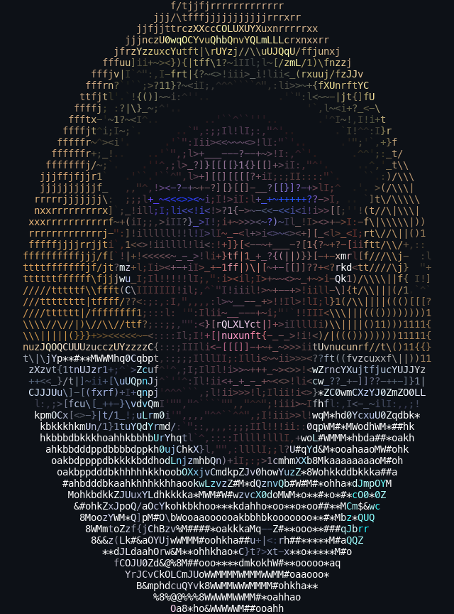

<!--
  GitHub profile README for @thabangTheActuaryCoder
  Hero = colored ASCII portrait (portrait.png) + neofetch-style info panel.
  Keep the info inside <pre> so the columns stay aligned on GitHub.
-->

<table border="0">
<tr>
<td valign="top" width="340">

</td>
<td valign="top">
<pre>
thabang@github
------------------------------------------
OS ........... macOS · Linux
Role ......... Senior Full-Stack AI Engineer @ 4S4
Studied ...... MSc Mathematical Statistics · UFS (Distinction)
PhD .......... Mathematical Statistics · Wits (in progress)
IDE .......... VS Code · JupyterLab · RStudio · AntigravityIDE

Lang.Prog .... Python · R · SQL · C# · Java · VBA · MATLAB
Lang.ML ...... TensorFlow · Keras · scikit-learn · PyTorch
Data ......... PostgreSQL · Spark · Databricks · Snowflake · dbt
Cloud ........ AWS · Azure · Docker · GitHub Actions
Lang.Real .... English · Xitsonga

Field ........ Quantitative Finance · Deep Learning · Bayesian
Certs ........ CFA Level I (in progress) · ASSA A112/A113

Hobbies ...... F1 (Ferrari) · Soccer · Running

Contact
Email ........ baloyibongani1@gmail.com
LinkedIn ..... thabang-bongani-junior-baloyi
GitHub ....... thabangTheActuaryCoder
</pre>
</td>
</tr>
</table>

<h3 align="center">Thabang Baloyi</h3>

<b>Quantitative Modelling · Mathematical Statistics · AI &amp; Data Engineering</b>

  
  
  
  

---

### 👋 About

Quantitative and AI engineering professional with an **MSc in Mathematical Statistics (distinction)**, backed by training in Statistics & Data Science, Actuarial Science, and quantitative finance. I work across **statistical modelling, machine learning, quantitative finance, and data/AI engineering** — combining rigorous quantitative analysis with end-to-end engineering.

### 💼 Experience

- **Senior Full-Stack AI Engineer** — *4S4* · Jun 2026 – Present
- **Artificial Intelligence Engineer** — *Full Stack* · Mar 2023 – May 2026
   Clients: Virgin Active (UK & SA), Expandly
- **AI / Machine Learning Engineer Intern** — *Full Stack* · Jan 2023 – Mar 2023
- **Group Risk Intern (Actuarial)** — *Discovery Limited* · Jan 2021 – Dec 2022

### 🎓 Education

- **PhD Mathematical Statistics** — University of the Witwatersrand · *in progress*
- **MSc Mathematical Statistics** — University of the Free State · *2026, Distinction (80%)*
- **BSc Honours, Statistics & Data Science** (minor Actuarial Science) — University of Cape Town · *2025*
- **BCom Management Studies** — University of Cape Town · *2022*

### 🛠️ Toolbox

### 🏅 Certifications &amp; Recognition

`CFA Level I (in progress)` · `ASSA exemptions A112 / A113` · `Moshal Scholarship` · `Dean's List — UFS` · `Best Aggregate, Actuarial Science`

---

  
  

  

<i>“All models are wrong, but some are useful.” — George Box</i>

